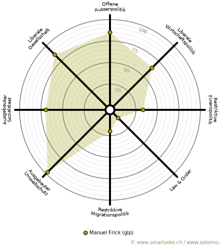

# Politik

Schon in jungen Jahren politisch interessiert, habe ich aber lange mit der Wahl einer Partei gehadert. Im Jahr
2015 bin ich schlussendlich den Grünliberalen beigetreten, da ich unsere Zukunft bezüglich des Klimawandels
und der Energiepolitik wegen des bürgerlichen
Rechtsrutsch gefährdet sah.
        
Kurz darauf wurden die Jungen Grünliberalen Schweiz und
drei Monate später die Zürcher Sektion gegründet, worauf
ich mich sofort engagierte. Ein Jahr später wurde ich ins Co-Präsidum der jglp Zürich gewählt und habe seitdem
wesentlich dazu beigetragen, die jglp zu einer festen Grösse in der Politik-Landschaft zu machen. Zählte die jglp
Zürich anfangs eine Handvoll aktiver Mitglieder, arbeiten heute fast 40 Freiwillige ehrenamtlich für eine
nachhaltige und fortschrittliche Zukunft.

## Ämter

* Vorstand Grünliberale Kanton Zürich seit 2017
* Co-Präsidium Junge Grünliberale Kanton Zürich seit Mai 2017
* Geschäftsleitung und Vorstand Junge Grünliberale Schweiz (Kreativchef / Marketing) seit 2017

## Kampagnen & Themen

* Taxigesetz ([20-Minuten](https://www.20min.ch/schweiz/zuerich/story/Taxi-11113902))
* Energiestrategie (Co-Leitung und Ideengenerator)
* Geldspielgesetz
* Nachtnetz am Donnerstag in Zürich ([20-Minuten](https://www.20min.ch/schweiz/zuerich/story/JGLP-wollen-Nachtbusse-auch-unter-der-Woche-31995915))

# Smartspider

Weitere Informationen findest du auf meinem [Smartvote-Profil](http://www.smartvote.ch/19_zh_leg/portrait/candidate/index/40600001453?lang=de_CH)
              

  

# Privat 

Squash, Badminton, Philosophie, Reisen

# Beruf

Während meiner Lehre zum Systemtechniker entdeckte ich die Macht der digitalen Welt, worauf ich das Studium in
Informatik anpackte und erfolgreich absolvierte. Nach einigen Jahren in der klassischen Software-Entwicklung
setzte ich mich nun auch beruflich für die Energiewende ein: Im Innovationslabor der Alpiq verfolge ich neue
Geschäftsmodelle und Cleantech-Themen.
  
* Software Engineer im Innovationslabor Oyster Lab by Alpiq
* Mitgründer bei Suncrowd, einem Startup-Projekt im Energiebereich
* Software Engineer bei Ergon Informatik AG
* Mitgründer & Software Engineer bei elinica communications GmbH
* Studium Informatik Vertiefung Software-Engineering an der ZHAW
* Berufslehre Informatik Vertiefung Systemtechnik

# Ich in fünf Worten

* Engagiert
* Kreativ
* Ganzheitlich
* Optimistisch
* Freiheitlich
