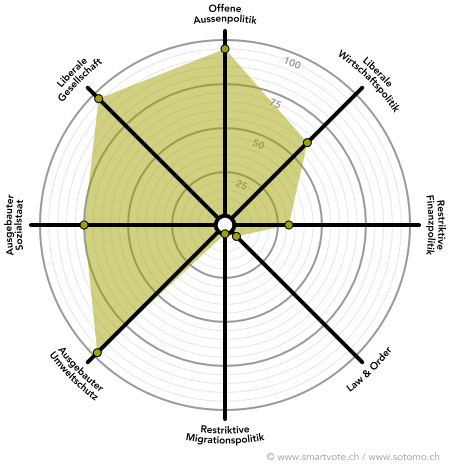

# Politik

Politisiert wurde ich während meiner Gymizeit durch Abstimmungen wie die 
Masseneinwanderungsinitiative oder Ecopop. Ich befasste mich zunächst vor 
allem mit Entwicklungs-, und Umweltfragen und wollte in diesen Bereichen 
die Welt verändern – die Politik schien mir das beste Mittel dazu. Nach der 
Matura bin ich schliesslich der glp beigetreten, die für mich eine sinnvolle 
Mischung aus meinen Idealen und der Realität verkörperte. 2015 wurde ich in 
den Vorstand der Jungen Grünliberalen Kanton Zürich gewählt, wo ich für 
Kommunikation und Social Media verantwortlich bin. Neben der glp bin ich auch 
Mitglied der _Operation Libero_, der _Veganen Gesellschaft Schweiz_ und von 
_Animal Rights Switzerland_.

## Engagement

* Vorstand Junge Grünliberale Kanton Zürich seit 2015
* Stv. Vorstand Grünliberale Kanton Zürich seit 2017
* Co-Präsident Ehemaligenverein Kantonsschule Uster

## Kampagnen & Themen
* Korrekturinitiative
* Massentierhaltungsinitiative
* Zürcher Wassergesetz

# Smartspider
             

  

# Privat 

Theater, Klavier, Philosophie, Literatur, Joggen

# Beruf

Nach der Matura und einem Zwischenjahr mit Spitalpraktikum, Sprachaufenthalt und Reisen begann ich 2016 
das Medizinstudium an der Uni Zürich. An der Medizin fasziniert mich die Kombination aus Naturwissenschaft 
und Arbeit mit Menschen. Durch das Verständnis von molekularen Vorgängen Patient*innen helfen zu können – 
das erfüllt mich und gibt mir die Motivation für mein Studium. Nebenbei arbeite ich in den Semesterferien 
im Spital. 
