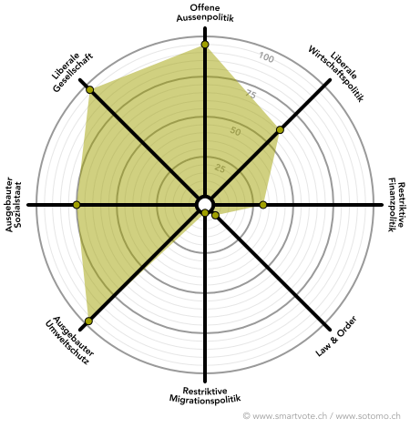

# Dafür stehe ich ein
       
Enkeltaugliche, liberale Politik für die Generationen von heute und morgen – dafür engagiere ich mich.
          
## 1. KLIMASCHUTZ JETZT! 

Die globale Erwärmung ist die grösste Herausforderung unserer Zeit und doch wird bislang viel zu wenig dagegen unternommen – auch in der Schweiz, auch im Kanton Zürich. Es kann nicht sein, dass wir auf Kosten der kommenden Generationen leben und sich diese mit Umweltkatastrophen und Hungersnöten abfinden müssen. 
Der Klimaschutz ist eine globale Aufgabe – um global erfolgreich zu sein, muss aber jeder Einzelne seinen Beitrag leisten. Der Kanton Zürich hat hier noch viel Potential!

  
  
  

        
## 2. GESUNDHEIT HEUTE UND MORGEN

Ich setze mich für eine qualitativ hochstehende Gesundheitsversorgung ein, die das Patientenwohl ins Zentrum stellt. Unser Gesundheitswesen steht in den nächsten Jahren vor grossen Herausforderungen. Behandlungsqualität und Finanzierbarkeit dürfen dabei nicht gegeneinander ausgespielt werden. Um das Kostenwachstum im Gesundheitswesen zu bremsen, sind intelligente Lösungen wie eine interkantonale Spitalplanung und eine Reduktion der administrativen Belastung seitens Pflege und Ärtz*innen gefragt. Auch der Mangel an Fachkräften ist ein ernst zu nehmendes Problem, das nur mit zusätzlichen Ausbildungsplätzen zu beheben ist. 

  
  
  

## 3. BILDUNG FÜR ALLE
Ein leistungsfähiges öffentliches Bildungssystem bildet in meinen Augen die Basis für eine funktionierende Wirtschaft - aber auch für unsere Demokratie. Für den Zugang zu Bildung soll es keine Rolle spielen, wie dick das Portemonnaie der Eltern ist - es muss absolute Chancengleichheit gelten. 
Der Bildungs- und Forschungsstandort Zürich gehört zu den weltweit führenden, was unserem Kanton einen enormen volkswirtschaftlichen Nutzen bringt. Diesen Standortvorteil gilt es zu erhalten und weiterzuentwickeln.

        
# Smartspider

