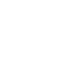
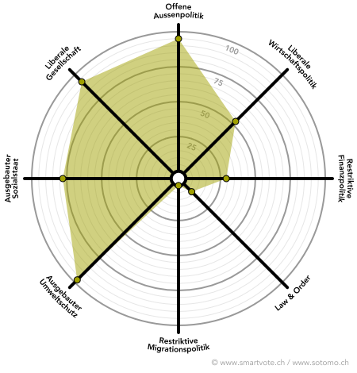

# Dafür stehe ich ein
       
Ein gutes Bildungssystem, Chancengleichheit und nachhaltige Umweltpolitik bilden das Fundament einer 
erfolgreichen Gesellschaft. Davon bin ich überzeugt und dafür setze ich mich ein.          
## 1. BESSER ESSEN

Klimaerwärmung und Ressourcenverbrauch sind die Herausforderungen für die Zukunft - packen wir sie schon heute
 an statt erst morgen!
Ein Thema, das uns alle ganz persönlich betrifft, sind die Lebensmittel. Wir essen, um zu überleben und um zu essen, 
fallen Emissionen in Herstellung und Transport, Verpackungs- und Lebensmittelabfälle an. Ich setze mich für 
nachhaltigere Produktion (Reduktion der Pestizide, saisonaler Anbau), kürzere Transportwege, weniger Verpackungen 
und weniger Lebensmittelabfälle ein.

  
  
  

        
## 2. BESSER SCHÜTZEN UND ERHALTEN - BIODIVERSITÄT

Das Bevölkerungswachstum, die Zersiedelung und der Klimawandel haben der Natur zugesetzt. Die Biodiversität hat 
abgenommen, viele Arten sind seltener geworden. Deshalb setze ich mich für mehr Naturschutz ein. Es braucht 
geeignete Lebensräume, um ein Zusammenleben von Mensch und Natur möglich zu machen. Dafür engagiere ich mich.

  
  
  

## 3. BESSER LEBEN - LIBERALE CHANCENKULTUR
Jeder Mensch hat eine faire Chance verdient, und soll die Möglichkeit haben, sein Leben nach seinen 
persönlichen Vorstellungen zu gestalten. Alle Menschen sollen vor dem Gesetz gleich sein, unabhängig 
beispielsweise von ihrem Geschlecht, ihrer Hautfarbe oder ihrer sexuellen Orientierung. Ich setze mich gegen 
die Schwächung der Privatsphäre ein.

  
## 4. BESSER LERNEN - BILDUNG FÜR ALLE
Die Schweiz, ist nicht besonders reich, was Bodenschätze betrifft. Umso wichtiger ist es für uns, dass wir ein 
gutes Bildungssystem pflegen.
Bildung bildet das Fundament für eine liberale Chancenkultur. Alle Menschen sollen die Möglichkeit haben, 
sich zu bilden; unabhängig von Geschlecht, Herkunft oder ökonomischen Mitteln.

       
 
# Smartspider

