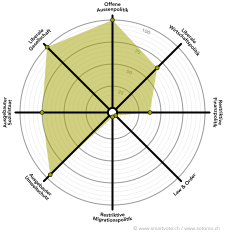

# Dafür stehe ich ein
    
## 1. VIELFÄLTIGE, LIBERALE GESELLSCHAFT

Vielfältigkeit und individuelle Freiheit machen die Schweiz aus. Ich stehe deshalb ein für...
* … den grösstmöglichen Schutz individueller Freiheitsrechte und Privatsphäre.
* … die vorbehaltlose rechtliche Gleichstellung gleichgeschlechtlicher Paare.
* … eine Liberalisierung von weichen Drogen wie Cannabis, damit der Schwarzmarkt trockengelegt und endlich wirksamer Jugendschutz durchgesetzt werden kann.

  
  
  

        
## 2. NACHHALTIGE RESSOURCENWIRTSCHAFT

Umweltschutz ist alternativlos. Ich setze mich deshalb ein für...
* … die Energiewende weg von fossilen, hin zu erneuerbaren Energieträgern.
* … gezielte Lenkungsabgaben auf CO2-Emissionen.
* … eine Förderung nachhaltiger Technologien, die gerade für den Wirtschaftsstandort Zürich eine grosse Chance darstellen.

  
  
  

## 3. INTERNATIONALE VERNETZUNG

Gesellschaft und Wirtschaft profitieren gleichermassen von einer starken internationaler Vernetzung. Ich engagiere mich deshalb für…
* … starke Handelsbeziehungen mit unseren europäischen Partnern, die mit dem Rahmenabkommen erneuert und für die Zukunft gesichert werden können.
* … eine offene Migrationspolitik, die den Mobilitätsbedürfnissen von Gesellschaft und Wirtschaft gerecht wird.
* … tiefgehende internationale Zusammenarbeit bei Forschung und Lehre, damit der Hochschulstandort Zürich auch in Zukunft Weltklasse bleibt.

## 4. INNOVATIVE, LIBERALE WIRTSCHAFTSPOLITIK
Eine starke Wirtschaft ist Grundlage für unseren Wohlstand. Ich bin deshalb…
* … für möglichst schlanke Regulierung und geringe bürokratische Hürden, insbesondere bei innovativen Start-Ups.
* … gegen die Abschottung einzelner Branchen von Wettbewerb und Innovation, wie etwa beim Taxigewerbe.
* … für eine Liberalisierung von Ladenöffnungszeiten.
        

## 5. VELO FIRST, AUTO SECOND</h2>

Das Auto ist von vorgestern, smarte Verkehrslösungen sind angesagt. Ich befürworte deshalb…
* … verursachergerechte Abgaben, Velowege und Elektromobilität.
* … Förderung innovativer Mobilitätsmodelle wie Carsharing, Carpooling oder Freefloating E-Bikes.
* … nachhaltige Raumplanung, die der Zubetonierung unserer Landschaft einhalt gebietet.

        
Weitere Positionen und ausführliche Begründungen sind auch in den <a href="https://zurich.jungegrunliberale.ch/wp-content/uploads/sites/2/2018/11/2018_revision_final.pdf"
 target="_blank">Leitlinien der Jungen Grünliberalen Zürich</a> zu finden. 
        
# Smartspider

