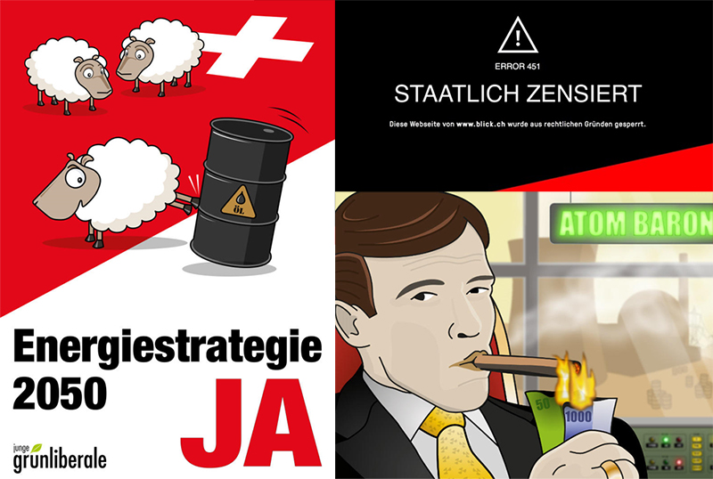
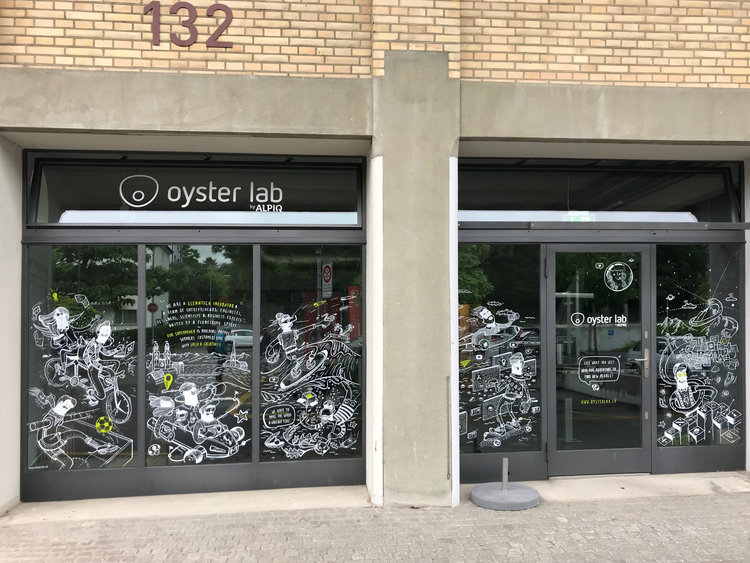

# Politik

Schon in jungen Jahren politisch interessiert, habe ich lange mit der Wahl einer Partei gehadert. Im Jahr
2015 bin ich schlussendlich den Grünliberalen beigetreten, da ich unsere Zukunft bezüglich des Klimawandels
und der Energiepolitik wegen des altbürgerlichen
Rechtsrutsch gefährdet sah.
        
Kurz darauf wurden die Jungen Grünliberalen Schweiz und
drei Monate später die Zürcher Sektion gegründet, worauf
ich mich sofort engagierte. Ein Jahr später wurde ich ins Co-Präsidum der jglp Zürich gewählt und habe seitdem
unermüdlich dazu beigetragen, die jglp national sowie kantonal zu einer festen Grösse in der Politik-Landschaft zu machen.

Zählte die jglp Zürich anfangs eine Handvoll aktiver Mitglieder, engagieren sich heute fast 40 Freiwillige ehrenamtlich
 mit viel Einsatz für eine nachhaltige und fortschrittliche Zukunft.

Viele Vorstösse und Aktionen tragen bereits meine Handschrift ([Kiffen für die AHV](https://www.20min.ch/schweiz/news/story/Kiffen-legalisieren--um-die-AHV-zu-finanzieren-21452039), Energiestrategie-Kampagne, 
Taxigesetz-Referendum, Energiestrategie-Kampagne) und weitere werden folgen!

## Engagement

Ich engagiere mich in vielen Ebenen für die gute Sache:
* Vorstand Grünliberale Kanton Zürich seit 2017
* Co-Präsidium Junge Grünliberale Kanton Zürich seit Mai 2017
* Geschäftsleitung und Vorstand Junge Grünliberale Schweiz (Kreativchef / Marketing) seit 2017
* Leitung jglp-Kampagne gegen das kantonale Taxigesetz
* Co-Leitung jglp-Kampagne für die Energiestrategie
* Co-Leitung jglp-Kampagne gegen das Geldspielgesetz

## Aktionen aus meiner Feder oder mit meiner Beteiligung
Eine Auswahl aus meiner bisherigen Tätigkeit:
* Referendum gegen das Taxigesetz ([20Min](https://www.20min.ch/schweiz/zuerich/story/Taxi-11113902))
* Nachtnetz am Donnerstag in Zürich ([20Min](https://www.20min.ch/schweiz/zuerich/story/JGLP-wollen-Nachtbusse-auch-unter-der-Woche-31995915))
* Kiffen für die AHV [20Min](https://www.20min.ch/schweiz/news/story/Kiffen-legalisieren--um-die-AHV-zu-finanzieren-21452039), [Tagi](https://www.tagesanzeiger.ch/schweiz/standard/Die-AHV-dank-Kiffern-sanieren/story/18694672), [Blick](https://www.blick.ch/news/schweiz/hanf-kann-millionen-steuern-einbringen-cannabis-macht-die-ahv-high-id8661027.html)
* Geldspielgesetz - Zensursimulation, welche Webseiten vermeintlich sperrt [Blick](https://www.blick.ch/news/politik/junge-glp-zeigt-mit-einer-zensur-simulation-so-will-der-bund-unser-internet-kastrieren-id7561685.html)
* "Junge geben Rösti aufs Dach" - Crowdfunding für Solaranlage auf dem Dach des SVP-Präsidenten [Blick](https://www.blick.ch/news/politik/abstimmungen/eine-solaranlage-fuer-den-groessten-atomlobbyisten-junge-geben-svp-roesti-eins-aufs-dach-id6653212.html)
* Plakat-Konter SVP-Schäfchen bei Energiestrategie [20min](https://www.20min.ch/schweiz/news/story/Junge-GLP-kontert-Plagiat-Plakat-der-SVP-26116037?httpredirect), [Blick](https://www.blick.ch/news/politik/abstimmungen/junge-gruenliberale-kontern-svp-plagiat-energie-schaefchen-schaffen-oelfass-aus-id6438495.html)
* Online-Energiekrieger gegen Fake-News bei der Energiestrategie [Aargauer Zeitung](https://www.aargauerzeitung.ch/schweiz/energie-krieger-gegen-kaltduscher-fakten-checker-sollen-svp-argumente-widerlegen-131243381)
* Handyspiel Atom-Baron für die Energiestrategie: [20min](https://www.20min.ch/schweiz/news/story/Mit-Guelsha--Atombaron-und-Bier-auf-Stimmenfang-21746446)
* Handyspiel Black Sheepy gegen die Durchsetzungsinitiative: [20min](https://www.20min.ch/digital/news/story/Mit-diesem-Spiel-lernt-das-SVP-Schaf-fliegen-16923554)

  

# Smartspider

Weitere Informationen findest du auf meinem [Smartvote-Profil](http://www.smartvote.ch/19_zh_leg/portrait/candidate/index/40600001453?lang=de_CH).
              

  

# Privat 

In der Freizeit bin ich oft auf dem Badminton- oder Squash-Court anzutreffen, verreise gerne CO2-kompensiert in tropische 
Länder mit Dschungel und lese auch mal ein gutes Buch (z.B. "Homo Sapiens" von Yuval Harari).

  

# Beruf

Während meiner Lehre zum Systemtechniker entdeckte ich die Macht der digitalen Welt, worauf ich das Studium in
Informatik anpackte und erfolgreich absolvierte. Nach einigen Jahren in der klassischen Software-Entwicklung
setzte ich mich nun auch beruflich für die Energiewende ein: Im Innovationslabor der Alpiq verfolge ich neue
Geschäftsmodelle und Cleantech-Themen.
  
* Software Engineer im Innovationslabor Oyster Lab by Alpiq
* Mitgründer bei Suncrowd, einem Startup-Projekt im Energiebereich
* Software Engineer bei Ergon Informatik AG
* Mitgründer & Software Engineer bei elinica communications GmbH
* Studium Informatik Vertiefung Software-Engineering an der ZHAW
* Berufslehre Informatik Vertiefung Systemtechnik

  

