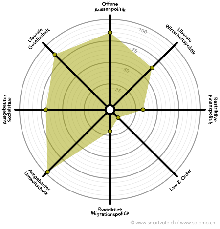

# Dafür stehe ich ein
       
Faire, liberale Politik welche stets das Wohl der Gesellschaft im Auge behält sowie kommende Generationen
respektiert - das ist mein Kompass.
          
## 1. MIT HERZBLUT FÜR DIE ENERGIEWENDE

Klimaerwärmung und Ressourcenverbrauch sind die Herausforderungen für die Zukunft -
packen wir sie entschlossen an!

Ich setze mich für griffige CO2-Gesetze, Förderung von Cleantech und eine rasche aber verträgliche Transformation von fossilen zu
erneurbaren Energien ein.

  
  
  

        
## 2. INNOVATION UND DIGITAL - BEREIT FÜR DIE ZUKUNFT

Innovation nützt der Gesellschaft - sie verbessert die Angebote, fordert grosse Player heraus und stärkt die
Wettbewerbsfähigkeit.

Ich setze mich für Startups und schlanke Regulierungen ein und engagiere mich vehement gegen Klientelpolitik,
Branchenschutz, Protektionismus und Filzpolitik.

  
  
  

## 3. LIBERALE CHANCENKULTUR

Jeder Mensch hat eine faire Chance verdient, und jeder Mensch soll sich mit persönlichen Einsatz alles
erreichen können - ohne Schikane und mit garantiert fairer Behandlung durch den Staat.

Ich setze mich ein für ausgeprägte Bildung, Starthilfe für sozial Benachteiligte und einen starken Rechtstaat, welcher 
Chancen garantiert und Schwache schützt.

## 4. Cannabisregulierung
Die Schweiz, besonders Zürich, war früher glänzendes Vorbild in der Drogenpolitik. Besonders in der Cannabis-
Politik folgen wir aber aktuell einem veraltetem Bild und verursachen so unnötig Millionen Kosten, obwohl wir 
es eigentlich besser wissen.
So überlassen wir Millionengewinne den Kriminellen statt sie zu versteuern und für AHV und Prävention einzusetzen, 
den Jugendschutz überlassen wir Dealern und eine Qualitätskontrolle existiert nicht.

Ich setze mich ein für eine liberale Drogenpolitik, welche sich an der Wissenschaft orientiert und nicht 
auf historischer Zufälligkeit basiert. Für Cannabis strebe ich eine Regulierung vergleichbar mit Alkohol an.
          

## 5. VELO FIRST, AUTO SECOND</h2>

Zu oft wird in der Verkehrsplanung das Auto gegenüber dem Langsamverkehr bevorzug - damit muss Schluss sein.
Den smarten Verkehrslösungen gehört die Zukunft: Ob Carsharing, Carpooling, Freefloating
E-Bikes, autonomes Fahren oder das klassische Velo - so sieht Lebensqualität aus!

Ich setze mich ein für verursachergerechte Abgaben, Velowege und Elektromobilität. Generell: Denken statt Klotzen!

        
# Smartspider

