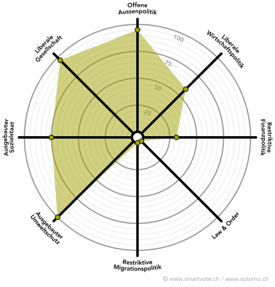

# Politik

Schon seit meiner Jugend bin ich im und fürs Quartier unterwegs. Ich war Leiter und am Schluss Scharleiter 
der Jungwacht Seebach, habe mit meiner Jugend und Sport Ausbildung Lager angemeldet, durchgeführt und später 
auch kontrolliert. 

Politisch interessiert war ich schon immer. Früher die Zeitung am Morgen, heute zusätzlich 
noch über den ganzen Tag ein News-Junkie. 

Mit 18 habe ich dann entschieden, dass ich bei der „neuen Partei“ den Grünliberalen mitmachen 
wollte. Nach ein paar passiven Jahren hat es mich, dann ab 2011 immer mehr hineingezogen und 
wurde mit dem Nachrücken in den Gemeinderat im August 2014 definitiv zu meinem grössten Hobby.

## Engagement

* Gemeinderat Stadt Zürich seit 2014
* Mitglied Spezialkommission Sicherheit und Verkehr, seit 2017 
* Gewähltes Mitglied Wahlbüro 11 seit 2010
* Nationaler Ersatz-Delegierter glp seit 2017
* Mitglied Spezialkommission Tiefbau- und Entsorgungsdepartement sowie Departement Industrielle Betriebe 2015 - 2017
* Mitglied Besondere Kommission Richtplan / BZO 2014 – 2016
* Mitglied Spezialkommission Gesundheits- und Umweltdepartement 2014 – 2015
*	Ehemaliger Vizepräsident, Mitglied Vorstand glp Kreis 11 & 12

# Smartspider
            

  

# Privat 

* Vorstand Quartierverein Seebach
* Bierliebhaber

# Beruf

* Verkehrsplaner in einer städt. Verwaltung seit 2015
* Studium der Verkehrssysteme 2011 – 2015
* Lehre als Automatiker 2005 – 2009

