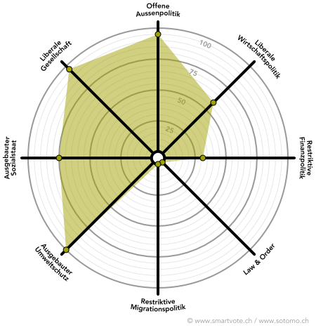

# Dafür stehe ich ein
                 
## 1. Wohnraum schaffen durch Verdichtung

Die Nachfrage nach bezahlbarem Wohnraum ist hoch. Wir unterstützen den gemeinnützigen Wohnungsbau und 
fördern private Bautätigkeit, um das Angebot an Wohnraum zu erweitern. Die Schaffung von wenigen konzentrierten 
Hochhauszonen und die Aufstockung von bestehenden Bauten darf kein Tabu sein. Zum Ausgleich müssen qualitativ 
hochwertige 
Frei- und Grünräume für die Anwohner/-innen bewahrt und geschaffen werden.

  
  
  

        
## 2. Weniger laut

Flugzeuge krachen über unsere Dächer. Autos beschleunigen brüsk vor unseren Balkonen. Lastwagen 
brummen ständig durch unsere Quartiere. Wo sind die ruhigen Grünanlagen geblieben? Wir Grünliberalen 
finden es unhaltbar, dass wir ständig mit zunehmendem Lärm belastet werden. Die Schweiz ist ein Land 
der Innovationen und smarten Technologien. Wir können unnötigen Lärm vermeiden oder deutlich reduzieren. 
Die Grünliberalen setzen sich ein für mehr Grün und weniger Lärm.

  
  
  

## 3. Städtische Natur schützen
Wir setzen uns dafür ein, dass Grünflächen und Baumbestände erhalten bleiben oder neu geschaffen werden. 
Gebäudebegrünung (auf Dächern oder Wänden) bieten grosses Potenzial, um den Stadtraum mit gesundem Grün 
zu füllen. Die Naherholungsgebiete wie der Wald sollen möglichst geschont werden, damit sie für Mensch 
und Tier gleichermassen attraktiv bleiben.

## 4. Solidarität über die Generationen
Der Erfolg des Schweizer Sozialstaates basiert auf Solidarität und der Sicherstellung der Kaufkraft in 
jedem Alter. Wir Grünliberale fordern die Gesprächsbereitschaft der Babyboomer mit den Jungen ein. Die 
Sozialsysteme können nur in Zusammenarbeit beider für zukünftige Generationen gesichert werden. Die 
Generationengerechtigkeit betrifft alle und ist für uns zentral.

 
## 5. Für die Vielfalt der Lebensmodelle
Die glp steht für die Selbstbestimmung und setzt sich ein, dass die Politik die Vielfalt der Lebensmodelle 
anerkennt. Wir unterstützen die Vereinbarkeit von Familie und Beruf mittels Teilzeitmodellen, flexiblen 
Arbeits- und familiäre Auszeiten. Respekt für verschiedene Formen geschlechtlicher Identität und sexueller
 Orientierung ist für uns selbstverständlich.
 
 
 

 
 
 
 

 
## 6. Mit Energie in die Zukunft
Die glp baut bei der Umsetzung der 2000-Watt-Gesellschaft auf wirtschaftliche Anreize und Lenkungsabgaben. 
Beispielsweise soll bei energetisch vorbildlichen Sanierungen den Bauherren eine höhere Ausnutzungsziffer 
zugestanden werden. Zur atomstromfreien Energieversorgung sind neben Wasser-, Wind- und Solarkraft auch 
Geothermie, Erdwärme und Biomasse stärker zu fördern.

# Smartspider

