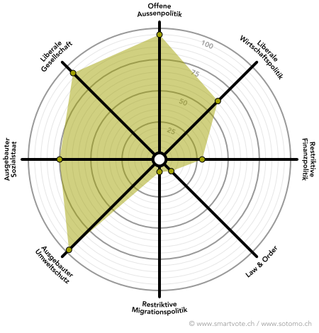

# Politik

Für mich gibt es drei Arten, etwas in der Welt zu verändern; Kapital - Bildung - Politik. Als Bankkauffrau kenne ich die Funktionsweisen des Kapitals, mit meiner Ausbildung zur Sekundarlehrerin erlange ich Zugang zum Bildungsbereich und mit dem Schritt in den Kantonsrat möchte ich noch den letzten Step machen. Zürich soll umweltfreundlicher und liberaler werden.

Vieles läuft in der Schweizer Politik solide. Dies reicht jedoch noch lange nicht für die Herausforderungen der Zukunft. Es wird Zeit, dass die Politik nicht der Realität hinterherläuft - wir sollten heute schon an morgen denken, denn nur so kommt die Schweiz vorwärts.

Die Grünliberalen arbeiten als innovative, erfrischende und noch junge Partei genau auf diese Zukunftsorientierung hin. 2017 wurde ich Mitglied bei der GLP und der Jungen GLP. Ein Jahr später wurde ich in den Vorstand der Jungen GLP Zürich gewählt, wo ich heute das Ressort Community Management führe und Anlaufstelle für unsere Mitglieder bin. Auch auf nationaler Ebene setze ich mich bei der Jungen GLP Schweiz für diverse Projekte ein.

# Engagement

* Vorstand Grünliberale Kanton Zürich
* Vorstand Frauenforum Tösstal und Umgebung (https://www.frauenforumtoesstal.ch/)

# WAS MACHE ICH FÜR UMWELT, WIRTSCHAFT UND GESELLSCHAFT?

* ich organisiere unsere Beteiligung am Klimastreik
* ich setze mich als Co-Präsidentin des Generationenkomitees gegen den STAF ein (www.generationenkomitee.ch)
* ich lebe vegan
* wenn es die Zeit zulässt, rette ich Froschleben am Bichelsee
* ich mache mich lokalpolitisch im Frauenforum Tösstal und Umgebung für mehr weibliche Beteiligung in der Politik stark  (https://www.frauenforumtoesstal.ch/ )

    <iframe width="560" height="349" src="https://www.youtube.com/embed/v6gHtM6ZztQ" frameborder="0" allowfullscreen></iframe>

# Smartspider

Weitere Informationen findest du auf meinem [Smartvote-Profil](http://www.smartvote.ch/19_zh_leg/portrait/candidate/index/40600001453?lang=de_CH)
              

  

# Privat 

Literatur, Philosophie, Kochen

# Beruf

seit November 2018
Nachhilfelehrerin bei ABACUS

02.2018 - 08.2018
Kundenberaterin Raiffeisenbank Aadorf-Elgg-Wiesendangen

08.2016 - 08.2017
Temporäreinsätze Zürcher Landwirtschaftliche Kreditkasse (ZLK)
 
08.2013 – 08.2016 
Lernende Kauffrau EFZ mit Berufsmaturität bei der Raiffeisenbank Aadorf-Elgg-Wiesendangen 

Schulbildung
Seit September 2018
Pädagogische Hochschule Zürich Sekundarstufe, I integrierter Bachelor/Masterstudiengang 2018H 
 
08.2016 – 09.2017 
Passerelle Kantonale Maturitätsschule für Erwachsene (KME), Zürich 
 
08.2013 – 08.2016 
Berufsschule und kaufmännische Berufsmaturität Berufsbildungszentrum Wil, SG 

